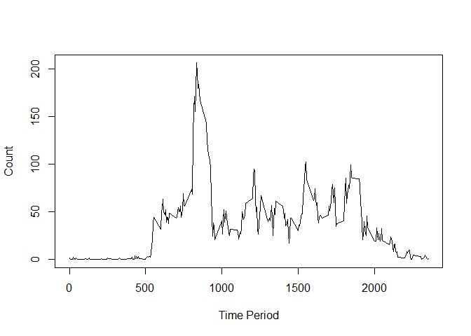
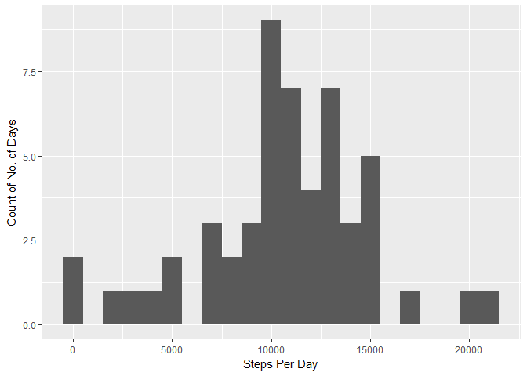
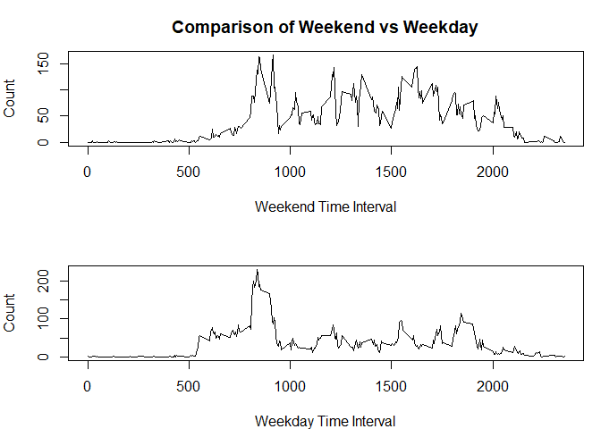

### By Arup Mitra

## Loading and preprocessing the data


```r
library(dplyr)
```

```
## 
## Attaching package: 'dplyr'
```

```
## The following objects are masked from 'package:stats':
## 
##     filter, lag
```

```
## The following objects are masked from 'package:base':
## 
##     intersect, setdiff, setequal, union
```

```r
library(ggplot2)
unzip("activity.zip")
activity<-read.csv("activity.csv")
stepsperday<- tapply(activity$steps,list(activity$date),sum)
```

## What is mean total number of steps taken per day?

Here is a histogram of the total number of steps taken each day.

```r
stepsperdaydf<- as.data.frame(stepsperday)
ggplot(stepsperdaydf,aes(stepsperday))+geom_histogram(binwidth=1000) +xlab("Steps per Day") + ylab("No. of Days")
```

```
## Warning: Removed 8 rows containing non-finite values (stat_bin).
```

<!-- -->
   
The mean and median number of steps are 


```r
meansteps<- mean(stepsperday,na.rm=TRUE)
mediansteps<-median(stepsperday,na.rm=TRUE)
print(meansteps)
```

```
## [1] 10766.19
```

```r
print(mediansteps)
```

```
## [1] 10765
```
## What is the average daily activity pattern?
Here is a time series plot of the 5-minute interval (x-axis)
and the average number of steps taken, averaged across all days (y-axis)


```r
intactivity<- tapply(activity$steps,activity$interval,mean,na.rm=TRUE)
intactivitydf<- as.data.frame(intactivity)
intactivitydf$period<-rownames(intactivitydf)
plot(intactivitydf$period,intactivitydf$intactivity, type="l",xlab="Time Period",ylab="Count")
```

<!-- -->
  
The interval which on an average contains the maximum number of steps:

```r
intactivitydf[which(intactivitydf$intactivity==max(intactivitydf$intactivity)),]
```

```
##     intactivity period
## 835    206.1698    835
```

## Imputing missing values
The total number of missing values in the dataset:

```r
sum(is.na(activity$steps))
```

```
## [1] 2304
```

Now we impute the mean for each interval into the NA values for the corresponding interval. The mean and the median are also calculated on the imputed data set

```r
impute.mean<- function(x) replace(x,is.na(x),mean(x,na.rm=TRUE))
activity.i <- activity %>% group_by(interval) %>% mutate(steps = impute.mean(steps))
stepsperday.i<- tapply(activity.i$steps,list(activity.i$date),sum)
stepsperday.i.df<- as.data.frame(stepsperday.i)
ggplot(stepsperday.i.df,aes(stepsperday))+geom_histogram(binwidth=1000) +xlab("Steps Per Day") +ylab("Count of No. of Days")
```

```
## Warning: Removed 8 rows containing non-finite values (stat_bin).
```

<!-- -->

```r
mean(stepsperday.i,na.rm=TRUE)
```

```
## [1] 10766.19
```

```r
median(stepsperday.i,na.rm=TRUE)
```

```
## [1] 10766.19
```
We observe that the mean is identical but the median is slightly changed.

## Are there differences in activity patterns between weekdays and weekends?
We now analyze the differences in activity patterns between weekdays and weekends
by adding a column wDay to the data frame and computing whether each date is a weekend


```r
activity.i$date <- as.Date(activity.i$date)
weekdays1 <- c('Monday', 'Tuesday', 'Wednesday', 'Thursday', 'Friday')
activity.i$wDay <- factor((weekdays(activity.i$date) %in% weekdays1), 
              levels=c(FALSE, TRUE), labels=c('weekend', 'weekday'))

activity.weekend<- tapply(activity.i$steps,list(activity.i$interval,activity.i$wDay),mean)
activity.weekend.df<- as.data.frame(activity.weekend)
activity.weekend.df$time <- rownames(activity.weekend.df)
par(mfrow=c(2,1),mar=c(4,4,3,1))
plot(y=activity.weekend.df$weekend,x=activity.weekend.df$time,type="l",xlab="Weekend Time Interval",ylab="Count",main="Comparison of Weekend vs Weekday")
plot(y=activity.weekend.df$weekday,x=activity.weekend.df$time,type="l",xlab="Weekday Time Interval",ylab="Count")
```

<!-- -->
   
We can therefore conclude that the steps are more well distributed during the 
weekend, whereas on weekdays there is a peak before 10am and relatively less activity during the rest of the day.


